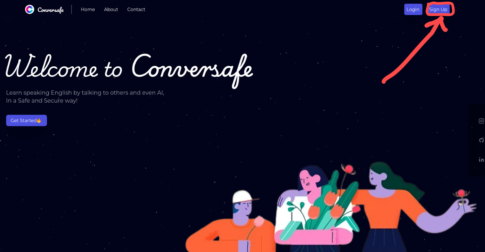
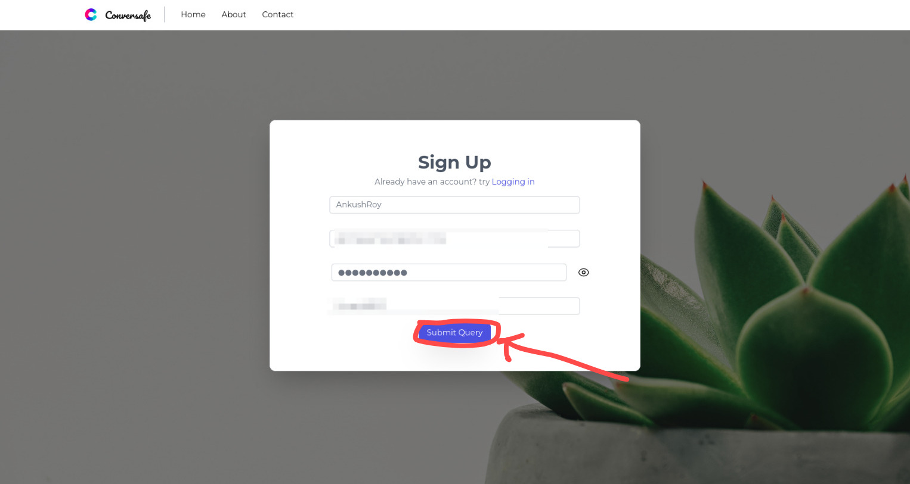
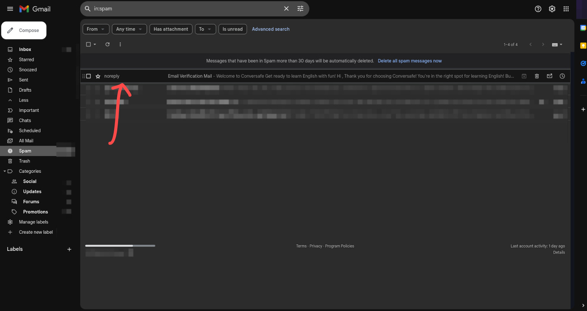
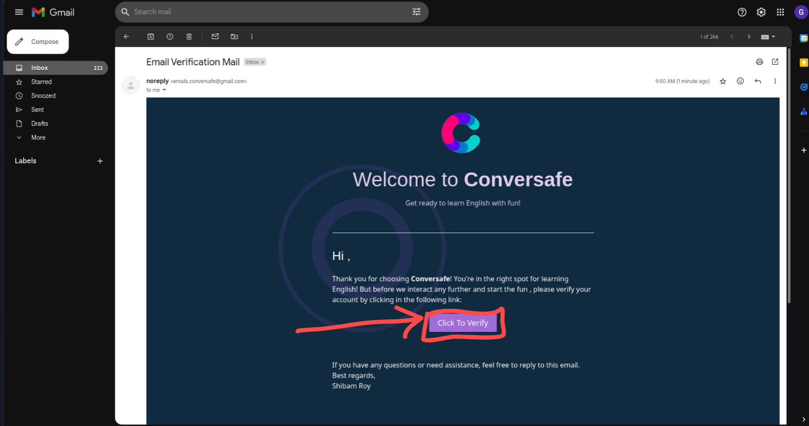
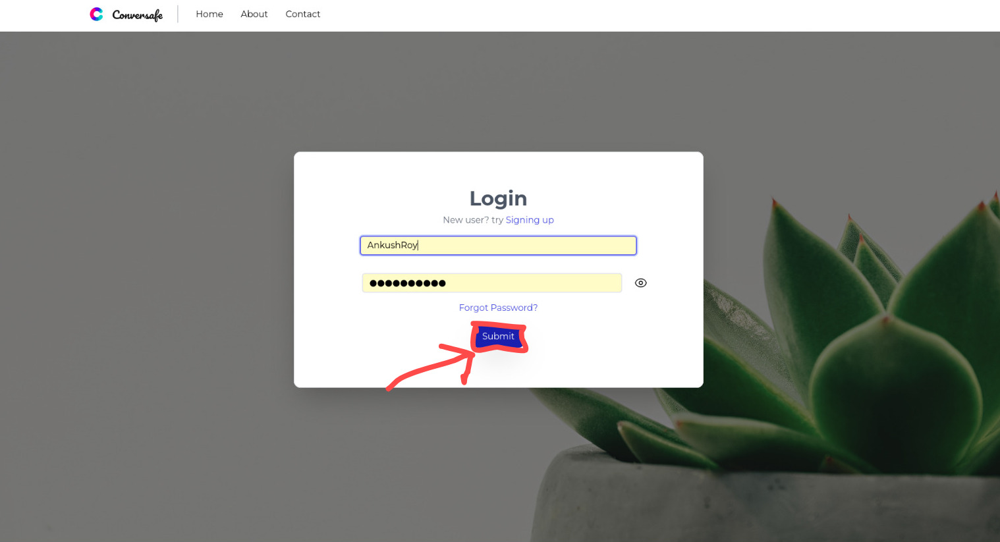
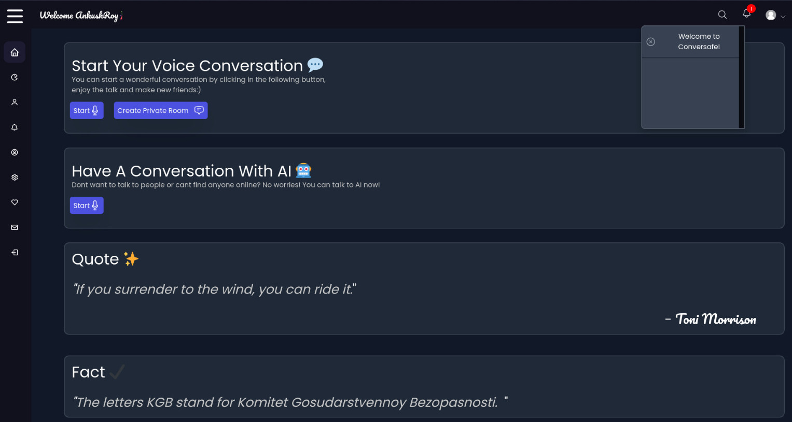

<h1 align="center">Welcome to Conversafe 👋</h1>

  
  

> Conversafe is an English learning platform designed to make mastering English both fun and engaging! This platform is more fun for pre-intermediate to interemediate users at the moment. This platform provides a learning environment through real conversations with other users. Infact, incase other users are not available, they can have a conversation with AI! It has many other amazing features like fun general knowledge quizzes, a friend system, and Daily quotes and facts too! This platform is extremely user-friendly and offers a welcoming space for learners to practice, learn, and have fun:)

### ✨ [Demo](https://conversafe.pythonanywhere.com/)

### Features
- Conversation with real peole (other learners)
- Conversation with AI in absense of other users
- Fun general knowledge quizzes
- Random Quotes, and Fun facts
- Friends system, so that users can make new friends
- Sources to more learning material, not exclusive to English, but many other skills too
- Extremely user-friendly UI

## How to Use
Conversafe is made to be super user-friendly , the steps are pretty much simple to follow , just follow them and begin your journey of learning!

<b> 1. This is the landing page of the website, click on the signup button at the top-right to create a new account.</b>( Press on login if you already have an account)

<b> 2. Once you get into the signup page, enter the details its asking for inorder to create an account. Next, click on the Submit button to send a verification email to the provided email.</b>

<b> 3. Go to your email providers website (in my case Gmail) , and check for an email. Make sure to check the Spam folder incase you don't find the email</b>

<b> 4. If its in the spam folder, move it to your inbox, and click on this link </b>

<b> 5. Go to the login page, and login with the same details that you used to create the account </b>

<b> 6. There you go! You successfully created your account, now you can explore on your own, its recommended to create the profile first (on the left sidebar, 5th option):)</b>

## To Run Locally
Running this project locally isn't too difficult either. Here is what is required:
## TO BE UPDATED

## Author

👤 **Shibam Roy**

* Website: https://shibamroy9826.github.io/
* Github: [@ShibamRoy9826](https://github.com/ShibamRoy9826)

## Show your support

Give a ⭐️ if this project helped you!
